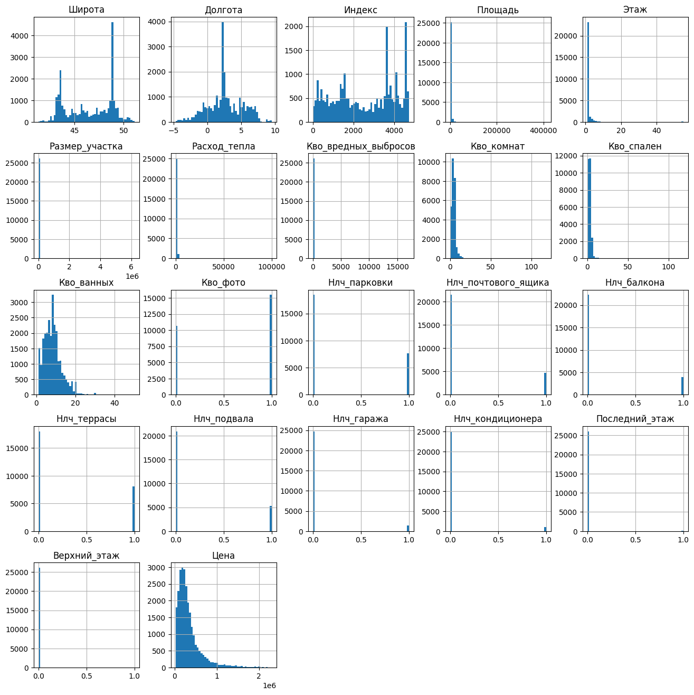
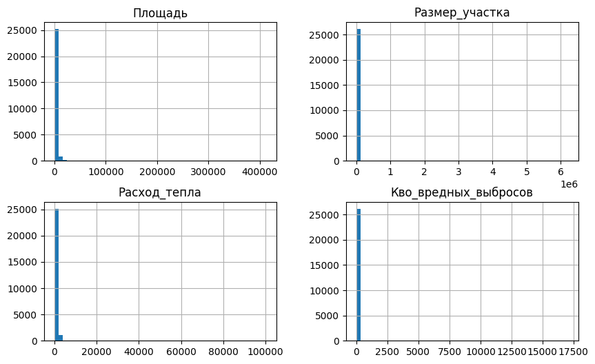
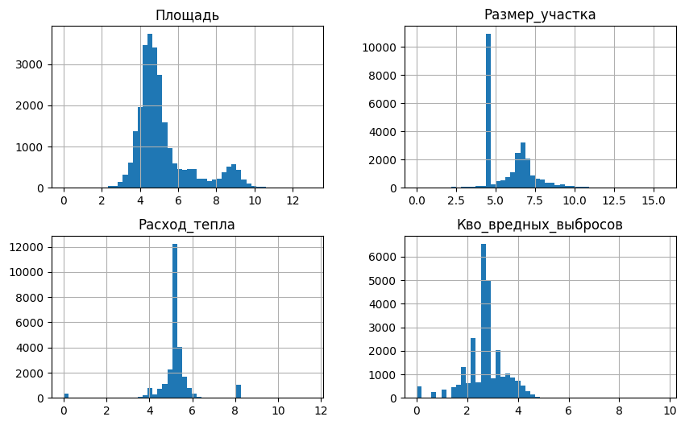
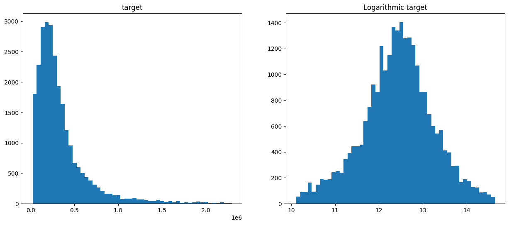
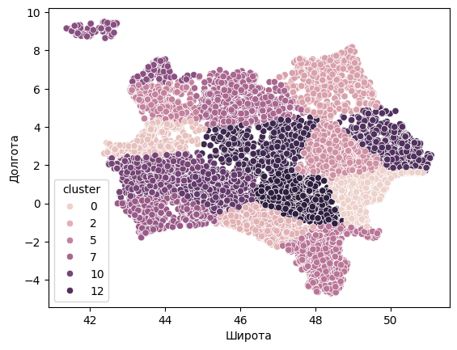
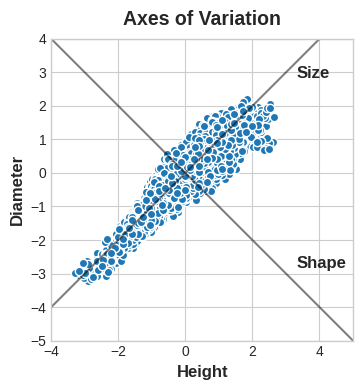
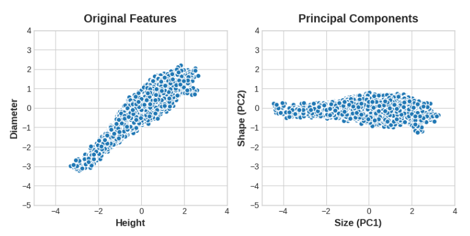
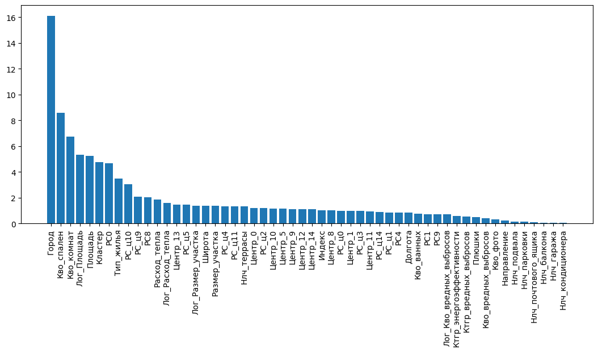

# Rucode 2024 (2-nd place)

**Public test**
MAPE = 0.247362 (score = 75.52638, top 3)

**Private test**
MAPE = 0.24154 (score = 75.84559, top 2)


## Описание задачи
Проект "Квартирный вопрос" — это миссия по созданию цифрового провидца в мире недвижимости. В ваших руках находится таблица, где за каждым столбцом скрываются ключи к тайне стоимости жилья: от уюта небольших квартир до роскоши просторных особняков, от тихих улочек до оживленных городских магистралей. Вашей задачей станет обучение модели, которая сможет предсказывать цены с непревзойденной точностью, точно анализируя каждый из этих параметров.

В этом проекте вам предстоит создать нечто большее, чем просто алгоритм — вы должны создать виртуального оценщика, способного проникать в суть каждого объекта недвижимости и с лёгкостью определять стоимость, основываясь на множестве факторов. В мире, где данные превращаются в реальные деньги, ваш искусственный интеллект станет незаменимым инструментом для тех, кто ищет точные и надежные прогнозы цен на жилье.

Вам необходимо реализовать алгоритм регрессии, который сможет по имеющимся данным предсказать цену недвижимости.

___
[Данные](https://www.kaggle.com/datasets/markovka/housing-issue)

[Веса для запуска решения (V1)](https://www.kaggle.com/models/markovka/catboostregressor/Other/default/1)

[Ноутбук](https://www.kaggle.com/code/markovka/taska-solution)
___

## Работа с данными
Описание датасета представлено на [kaggle](https://www.kaggle.com/datasets/markovka/housing-issue).

### [Заполнение пропущеных значений](https://www.kaggle.com/code/markovka/taska-solution#Filling-NaN)

Большинство пропущенных значений было заполнено исходя из природы типа объекта.

* Для типов жилья с неопределенным размером участка (дом на воде, комната, мастерская, ночлежка) размер участка принимался за 0
* Для типов жилья с неуказанной категорией энергоэффективности и вредных выбросов была введена категория "unknown", а расход тепла и значение вредных выбросов принимались за 0
* Для типов жилья с неизвестным направлением так же была введена категория "unknown"
* Для комнат с неуказанным количеством спален, количество спален принималось за 1
* Остальные пропущенные числовые признаки были заполнены медианой агреггированной по каждому типу жилья
* Остальные пропущенные категориальные признаки были заполнены модой с использованием [SimpleImputer](https://scikit-learn.org/stable/modules/generated/sklearn.impute.SimpleImputer.html) из [sckit-learn](https://scikit-learn.org/stable/index.html)

### [EDA](https://www.kaggle.com/code/markovka/taska-solution#Exploratory-Data-Analysis-(EDA))



Как видно из гистограмм, распределение многих ризнаков далеко от нормального.

**Логарифм признаков**

Для сравнения было выведено распределение числовых признаков Площадь, Размер_участка, Расход_тепла, Кво_вредных_выбросов.



Далее было выведено распределение значения логарифма этих же числовых признаков.



Видно, что это распределение уже ближе к нормальному. Добавление значений логарифма этих четырех признаков повысило качество модели. 

**Логарифм таргета?!**

Более инетересной идеей было заменить целевые значения цены на нежвижимость значением ее логарифма.



Качество модели при этом повысилось, но для корректного контроля качества обучения модели пришлось подменить валидационную метрику MAPE -> MyMAPE (см. [metric.py](metric.py)).

**KMeans (Кластеризация)**

Для более глубокого анализа данных о расположении недвижимости были добавлены признаки связанные с принадлежностью к определенному кластеру, а также с расстоянием от текущего метсоположения до центров всех кластеров.



Добавление этих признаков сильно повлияло на качество модели в лучшую сторону.

**PCA (Метод главных компонент)**

Для обощения признаков была произведена обработка данных методом главных компонент.

*Пример*, 2 компоненты (источник: https://www.kaggle.com/code/ryanholbrook/principal-component-analysis#Principal-Component-Analysis):



Добавленные признаки позволяют модели посмотреть на данные по новому.



В случае данных соревнования были добавлены 2 группы главных компонент:
1. PCA для исходных числовых признаков (PC{i})
2. PCA для числовых признаков полученных при кластеризации (PC_ц{i})

### [Удаление выбросов](https://www.kaggle.com/code/markovka/taska-solution#Outliers-processing)

Для удаления выбросов был использован алгоритм [IsolationForest](https://scikit-learn.org/stable/modules/generated/sklearn.ensemble.IsolationForest.html) из [sckit-learn](https://scikit-learn.org/stable/index.html) с параметрами:


```contamination = 0.01```

```max_features = 0.5```

```n_estimators = 500```

### [Фильтрация признаков](https://www.kaggle.com/code/markovka/taska-solution#Deleting-bad-features)

После всех манипуляций в данных появилось слишком много признаков.
1 часть признаков была отброшена из-за низкого значения [Mutal information](https://scikit-learn.org/stable/modules/generated/sklearn.feature_selection.mutual_info_regression.html) (уровень зависимости между признаком и таргетом).

2 часть признаков была отброшена после обучения, тк модель сочла их мало информативными. Уровень информативности был получен с помощью ```get_feature_importance()```




## [Подбор параметров и обучение](https://www.kaggle.com/code/markovka/taska-solution#Model-and-training)

Для решения данной задачи регрессии была выбрана модель [CarBoostRegressor](https://catboost.ai/en/docs/concepts/python-reference_catboostregressor).

**Валидационная метрика**

В лидерборде соревнования использовалась метрика MAPE, но тк в нашем случае модель предсказывала логарифм цены, а не ее значения, была написана специальная метрика (см. [metric.py](metric.py)). для более правдоподобных результатов валидации.

### [Optuna](https://www.kaggle.com/code/markovka/taska-solution#Selection-of-training-parameters)

Для подбора параметров обучения использовался фреймворк [Optuna](https://optuna.org/).

Подобранные параметры: 

* ```l2_leaf_reg = 2.81255```
* ```learning_rate = 0.0721322```
* ```grow_policy = ‘Depthwise’```
* ```rsm = 0.4535```
* ```depth = 10```

### [Bagging and KFold](https://www.kaggle.com/code/markovka/taska-solution#Training)

Для достижения максимального качества на 6 частях тренировочной выборки был обучен ансамбль моделей [CarBoostRegressor](https://catboost.ai/en/docs/concepts/python-reference_catboostregressor). Выборка была поделена на части с помощью [KFold](https://scikit-learn.org/stable/modules/generated/sklearn.model_selection.KFold.html).

[Веса модели](https://www.kaggle.com/models/markovka/catboostregressor/Other/default/2) и [ноутбук](https://www.kaggle.com/code/markovka/taska-solution) для запуска всех экспериментов выложены на kaggle. 
